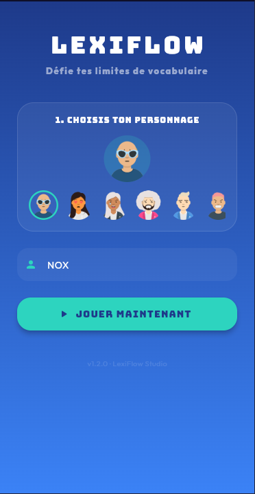
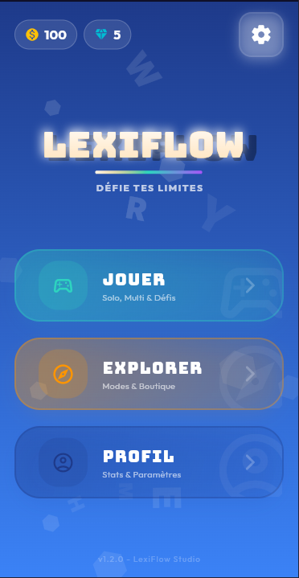
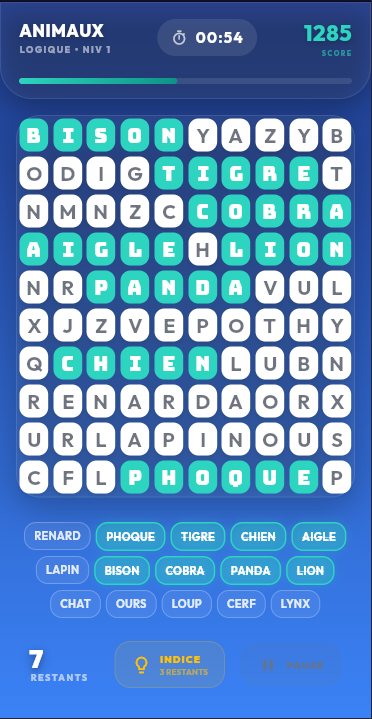
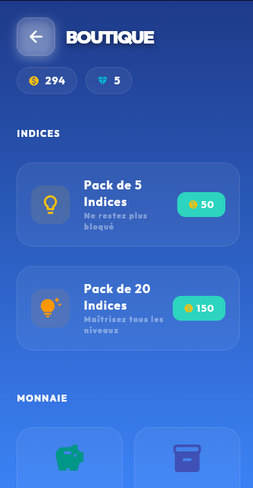

# LexiFlow

> Un jeu de recherche de mots moderne, rapide et compétitif, construit avec Flutter.

[](https://flutter.dev/)
[](https://dart.dev/)
[](https://firebase.google.com/)
[](#licence)

LexiFlow transforme la recherche de mots en une expérience de jeu complète : exploration de mondes, grilles évolutives, défis quotidiens, progression, récompenses, classements et affrontements entre joueurs.

## Aperçu

<p align="center">
  
  
  
  
</p>

## Sommaire

- [Fonctionnalités](#fonctionnalités)
- [Aperçu](#aperçu)
- [Architecture](#architecture)
- [Prérequis](#prérequis)
- [Installation](#installation)
- [Lancement](#lancement)
- [Tests et qualité](#tests-et-qualité)
- [Configuration Firebase](#configuration-firebase)
- [Structure du projet](#structure-du-projet)
- [Contribution](#contribution)
- [Licence](#licence)

## Fonctionnalités

- **Campagne solo** : progression par mondes et niveaux, avec plusieurs tailles de grille.
- **Modes de jeu variés** : classique, chronométré, zen, difficile, Blitz et Chaos.
- **Mode Blitz** : enchaînement de grilles sous pression du temps et suivi du meilleur score.
- **Mode multijoueur** : recherche d’adversaire, invitations et duels synchronisés via Firestore.
- **Défis quotidiens** : objectifs générés et progression persistée localement.
- **Tournois et classements** : points de tournoi, score ELO et tableaux des meilleurs joueurs.
- **Profil et récompenses** : profil joueur, monnaie virtuelle, boutique et récompenses quotidiennes.
- **Expérience soignée** : animations, confettis, retours haptiques, effets sonores et interface Material 3.
- **Mode invité** : l’application reste utilisable localement lorsque Firebase n’est pas disponible sur la plateforme cible.

## Architecture

LexiFlow suit une organisation Flutter modulaire :

- `screens/` contient les écrans et les parcours utilisateur.
- `widgets/` regroupe les composants visuels réutilisables.
- `providers/` centralise l’état applicatif avec Riverpod et StateNotifier.
- `models/` définit les modèles métier sérialisables.
- `data/` contient les données statiques des mondes et des niveaux.
- `utils/` rassemble les services techniques : grille, sons, haptique, persistance et Firebase.

L’état local s’appuie notamment sur `shared_preferences`. Les fonctionnalités en ligne utilisent Firebase Authentication et Cloud Firestore lorsqu’une configuration Firebase valide est disponible.

## Prérequis

- Flutter compatible avec Dart `^3.8.1`.
- Android Studio et/ou Xcode selon la plateforme ciblée.
- Un appareil ou émulateur Android, iOS, macOS, Linux, Windows ou Web selon les besoins.
- Un projet Firebase uniquement pour les fonctionnalités nécessitant un compte ou une synchronisation en ligne.

Vérifiez votre environnement avec :

```bash
flutter doctor
```

## Installation

Clonez le dépôt, puis installez les dépendances :

```bash
git clone <URL_DU_DEPOT>
cd search_word
flutter pub get
```

> Remplacez `<URL_DU_DEPOT>` par l’URL officielle du dépôt lorsqu’elle sera publiée.

## Lancement

Listez les cibles disponibles :

```bash
flutter devices
flutter run
```

Pour cibler une plateforme précise :

```bash
flutter run -d <device_id>
```

## Tests et qualité

Les commandes de vérification recommandées sont :

```bash
flutter analyze
flutter test
```

Avant toute proposition de modification, exécutez ces deux commandes et signalez dans votre pull request les vérifications effectuées ainsi que les éventuels prérequis de plateforme.

## Configuration Firebase

Firebase est initialisé de manière tolérante au démarrage : l’application peut afficher son interface lorsque les options Firebase ne sont pas disponibles, mais l’authentification, les classements, les tournois et le multijoueur nécessitent une configuration fonctionnelle.

Pour activer ces fonctionnalités dans votre environnement :

1. Créez ou sélectionnez un projet dans la console Firebase.
2. Enregistrez les applications correspondant aux plateformes ciblées.
3. Ajoutez les fichiers de configuration générés par Firebase à leurs emplacements attendus par Flutter.
4. Activez Authentication et configurez Cloud Firestore selon les règles de sécurité de votre environnement.
5. Ne commitez jamais de clé privée, de secret ou de fichier de configuration destiné à un environnement confidentiel.

La configuration actuellement versionnée pour Android peut nécessiter une adaptation avant une distribution publique. Vérifiez également les réglages iOS, desktop et Web avant d’activer leurs fonctions en ligne.

## Structure du projet

```text
.
├── assets/          # Icônes, images et sons
├── lib/
│   ├── data/        # Données des niveaux
│   ├── models/      # Modèles métier
│   ├── providers/   # État et logique applicative
│   ├── screens/     # Écrans Flutter
│   ├── utils/       # Services et utilitaires
│   └── widgets/     # Composants réutilisables
├── test/            # Tests Flutter
├── android/         # Intégration Android
├── ios/             # Intégration iOS
├── macos/           # Intégration macOS
├── linux/           # Intégration Linux
├── windows/         # Intégration Windows
└── web/             # Intégration Web
```

## Contribution

Les contributions sont les bienvenues : correction de bugs, amélioration de l’expérience, nouveaux niveaux, documentation et tests. Consultez [CONTRIBUTING.md](CONTRIBUTING.md) avant de commencer.

## Licence

Aucun fichier de licence n’est actuellement présent dans ce dépôt. Les conditions de réutilisation, de modification et de redistribution restent donc **à préciser par les mainteneurs**. N’ajoutez pas de contenu provenant d’un tiers sans vérifier ses droits et sa licence.

## Remerciements

LexiFlow s’appuie sur l’écosystème Flutter et sur plusieurs packages open source déclarés dans [`pubspec.yaml`](pubspec.yaml). Merci à leurs auteurs et à leurs mainteneurs.
